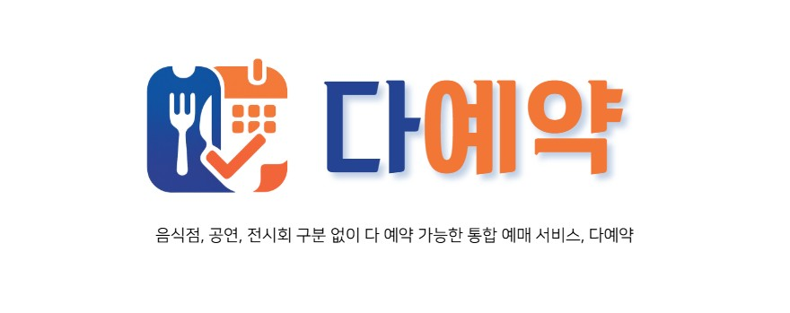
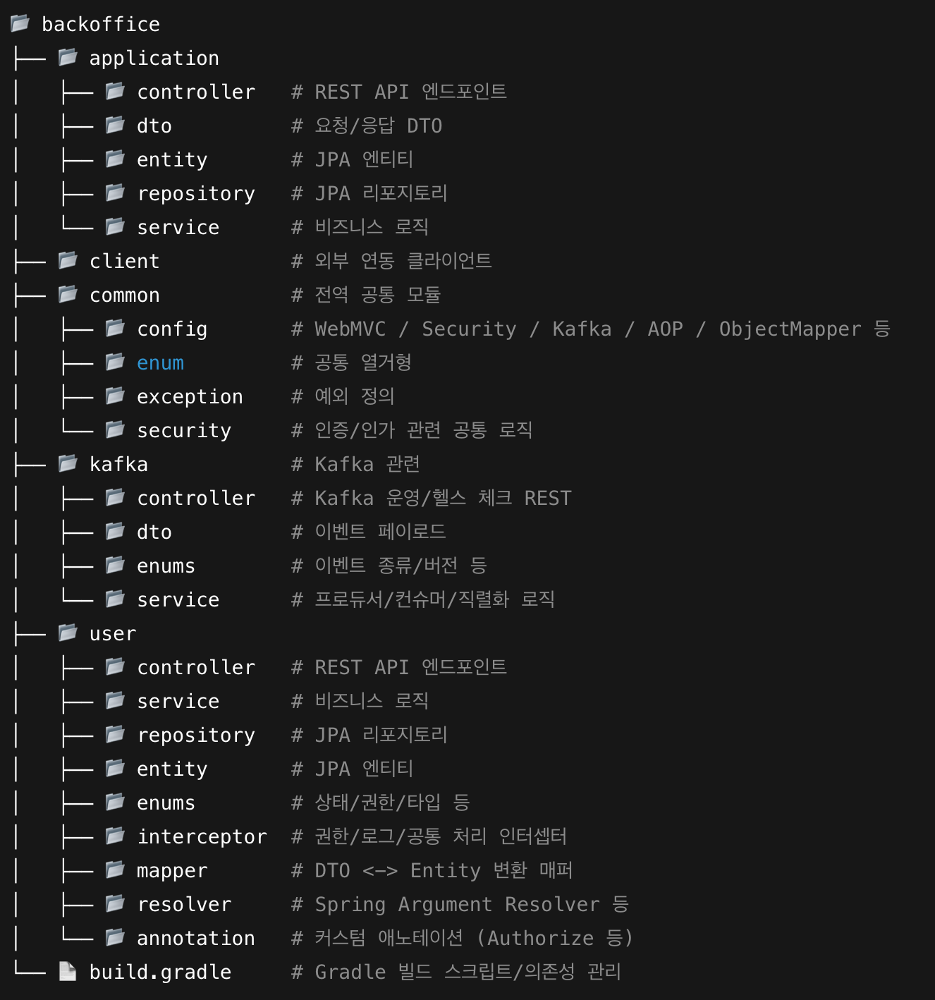
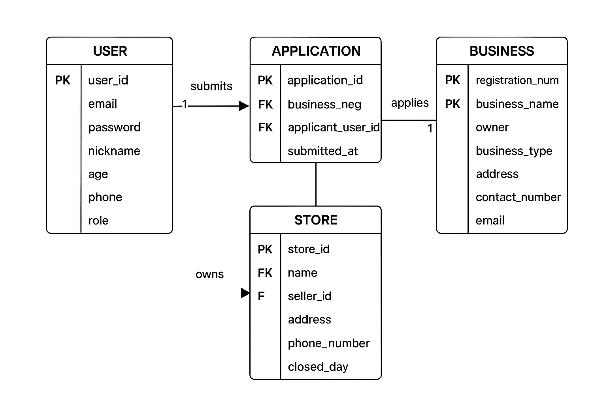
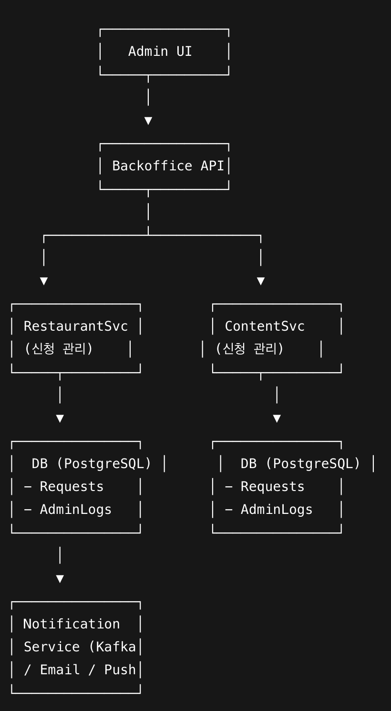

# 다예약 - MSA 기반 멀티 컨텐츠 통합 예매 서비스
## 백오피스 서비스 - 'Backoffice'
📋 공연,전시회,음식점 관리 및 승인 시스템 📋

[홈페이지](https://github.com/Lucky-Bikini-City-4/backoffice-service) | [Notion](https://www.notion.so/teamsparta/4-2612dc3ef51480679e40c1af55c69c0d)

---

=======
## 목차
- 프로젝트 소개
- 기능 소개
- 기술 스택
- 브랜치 및 디렉토리 구조
- 아키텍처 설계
- 관리자 승인/거절 기능
- 의사결정 및 데이터베이스 선택 근거
- API 명세

---

## 🚩 1. 프로젝트 소개
**MSA 기반 멀티 콘텐츠 통합 예매 서비스 백오피스**

**프로젝트 개발 기간:** 25.09.01 ~ 25.10.03

**목적:** 통합 예매 시스템 내 관리자용 음식점, 공연, 전시회 승인 및 등록 관리

- 음식점, 공연, 전시회 등 다양한 콘텐츠의 등록/승인/관리 기능 제공
- 점주 신청자 관리 기능 제공
- 승인된 서비스를 사용자 서비스(다예약 앱)와 연동

---

## ✨ 2. 기능 소개
### 담당 기능 : 음식점, 전시회, 공연 관리/승인

#### 점주 정보 관리
- 점주별 음식점 등록 내역 조회
- 연락처, 주소, 영업시간 등 정보 관리

#### 승인/거절 로직
- 신청서 작성 및 승인 요청 → 관리자(`MASTER`) 승인/거절 → 서비스 등록 및 신청자 알림
- 권한 검증: `AuthorizationInterceptor`와 `AccessCheckService`를 통한 `MASTER` 권한 확인
- 승인 이벤트를 Kafka로 전달하여 각 서비스(음식점, 공연, 전시회) 실시간 동기화
- 거절 시 거절 사유 입력 필수, 신청자에게 알람 발송

---

## 📚 3. 기술 스택
- **Backend:** Java 17, Spring Boot (JPA, Security, AOP, Kafka, Feign, Eureka)
- **DB:** PostgreSQL
- **Infra:** AWS EC2

---

## 🗂️ 4. 브랜치 및 디렉토리 구조
### 브랜치
- `main`: 배포용 브랜치
- `dev`: 개발용 브랜치

### 디렉토리 구조

---

## ⚙️ 5. 아키텍처 설계
- MSA 기반 서비스 분리 (Backoffice ↔ Restaurant Service)
- 승인 이벤트 발생 시 Kafka로 이벤트 전달
- 
  

  

- 신청서 상태 관리: `PENDING` → `APPROVED` / `REJECTED`
- AdminActionLog 테이블로 승인/거절 이력 저장
- Kafka 이벤트를 통해 각 서비스에 승인 결과 전송
- Notification Service에서 신청자에게 결과 알림 발송

---

## ✅ 6. 관리자 승인/거절 기능
### 데이터베이스 테이블

**Requests 테이블**
- `id`, `applicantId`, `type`, `status(PENDING/APPROVED/REJECTED)`

**AdminActionLog 테이블**
- `id`, `adminId`, `requestId`, `action(APPROVE/REJECT)`, `timestamp`

### 서비스 흐름
1. 점주/사용자가 신청서 작성 → `PENDING`
2. 관리자가 백오피스에서 승인/거절 선택
3. 요청 상태 업데이트 (`APPROVED` / `REJECTED`)
4. AdminActionLog 기록
5. Kafka 이벤트 발행 → 각 서비스 실시간 동기화
6. Notification Service를 통해 신청자 알림 발송

---

## 📄 7. 의사결정 및 데이터베이스 선택 근거

### 예방적 조치
- **권한 검증 강화**
  - 문제 예측: `MASTER` 권한이 없는 사용자가 승인/거절 기능에 접근할 가능성
  - 조치: `AuthorizationInterceptor` 적용 및 `AccessCheckService` 권한 확인
  - 결과: 관리자 권한이 없는 사용자의 접근 차단, 보안 강화
  
- **중복 신청서 처리 예방**
  - 문제 예측: 동일 점주의 여러 요청 동시 처리 시 상태 불일치 가능성
  - 조치: 요청별 Lock 처리 및 DB 트랜잭션 적용, `PENDING` 상태만 승인 가능
  - 결과: 중복 승인/거절 문제 예방, 데이터 무결성 확보

### 데이터베이스 선택: PostgreSQL vs MySQL

**요구 사항**
- **백오피스**
  - 다양한 마이크로서비스와 연계되는 신청서/권한 관리 데이터 처리
  - 추후 로그/사용자 분석, 데이터 고도화 가능
- **음식점**
  - 예약 가능한 좌석 수를 실시간으로 예매 서비스에 제공
  - 기본 정보는 변경 빈도가 낮고, 예약 데이터 접근 빈도 높음

**비교**
1. **PostgreSQL**
  - 🔵 ACID 준수로 트랜잭션 안전성 및 데이터 무결성 보장
  - 🔵 JSONB, CTE, Window 함수 등 복잡한 쿼리 처리 가능
  - 🔵 Kafka/Zipkin 로그 데이터를 JSONB로 저장 및 분석 가능
  - ❌ 읽기 성능은 MySQL 대비 약간 느릴 수 있음
2. **MySQL**
  - 🔵 높은 읽기 성능과 스케일링 용이
  - 🔵 기존 음식점 서비스와의 호환성 확보
  - 🔵 예약 좌석 데이터처럼 접근 빈도가 높은 테이블에 적합
  - ❌ 복잡한 트랜잭션이나 JSONB 기반 고급 쿼리 활용 제한

**결정 근거**
- 백오피스: PostgreSQL 채택 → 복잡한 트랜잭션과 로그 분석 가능, 데이터 확장성 확보
- 음식점: MySQL 채택 → 예약 좌석 데이터 처리에 적합, 읽기 성능 및 스케일링 강점

---
